# hexcymatix


`hexcymatix` is an exploratory research project, loosely envisioned as a
binary reverse engineering tool for extracting structural information from
repeated byte patterns in binary files.

The idea never materialized into a usable tool, but still yields some
fascinating representations of the striking self-symmetry in everyday data.

## Overview

Sometimes in reverse engineering you have an example of some data — a table, a
compressed blob, a protocol payload — and want to find similar data elsewhere in
a file, without yet being able to write a rule or parser that describes it.  You
want similarity without specification.

`hexcymatix` posits that repeated byte strings imply structure or relationship,
even if we don't know what that structure is.  By visualizing repetitions, we
can surface related data without knowing exactly what we're looking for.

For example, the Pensées passage below has several self-repeating sequences 
(' incapable of ', ' which he ', 'ing either ') — `hexcymatix` lays the file out
across two lines and connects any repeated byte sequences of at least 8 bytes:

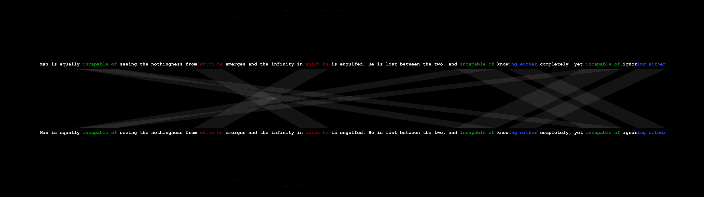

The connections that emerge then hint at underlying structure and relationships
in the data. 

Repeating this process on an everyday binary file starts to automatically pull
out unexpected self-similarity, connections, and structure.  As an example, here
is the error lookup executable in a standard Windows install:

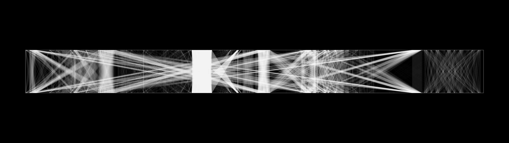

The most important part of the process is adding arcs between the fragment
connections to make the output look cool:

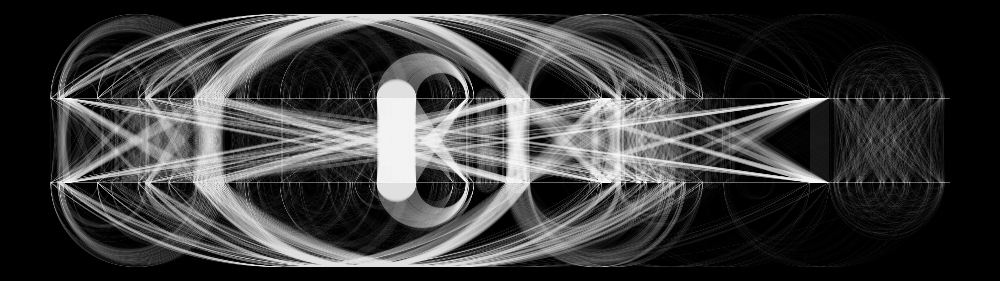

Having completely lost the plot, we can experiment with varied representations
of the data.  For example, the same file and connections rendered around the
perimeter of a circle appears as follows:


## Usage

```
python hexcymatix.py [options] file [file ...]
```

### Flags

| Flag | Description |
|------|-------------|
| `--circular` | Circular layout: byte offsets map to angles on a ring (default) |
| `--linear` | Parallel-bars layout: two horizontal bars connected by crossing quads |
| `--top N [N ...]` | Keep only the N longest fragments before rendering; pass several values to render one image per cutoff |
| `--no-arcs` | Draw chords only, skipping the arcs (substantially faster, less visual noise) |
| `--resolution RES` | Output resolution as `WxH` or a preset: `480p`, `720p`, `1080p`, `1440p`, `4k`, `uwfhd` (2560x1080), `suwfhd` (3840x1080) (default: `1080p`) |
| `--ultra` | Shorthand for `--resolution 4000x4000` |
| `--circle-fill F` | Fraction of the canvas diameter used by the circle (default: `0.25`, or `0.50` for the ultra-wide presets) |
| `--jpg` | Also write an 80% quality JPEG alongside each PNG |
| `--output-dir DIR` | Directory for output files (default: `output`) |

### Examples

```sh
# Circular visualization of an executable
python hexcymatix.py --circular guidgen.exe

# Linear visualization, top 500 fragments only
python hexcymatix.py --linear --top 500 guidgen.exe

# Batch, 4K output
python hexcymatix.py --circular --resolution 4k *.exe
```

## Output

### Executables

#### cmd.exe

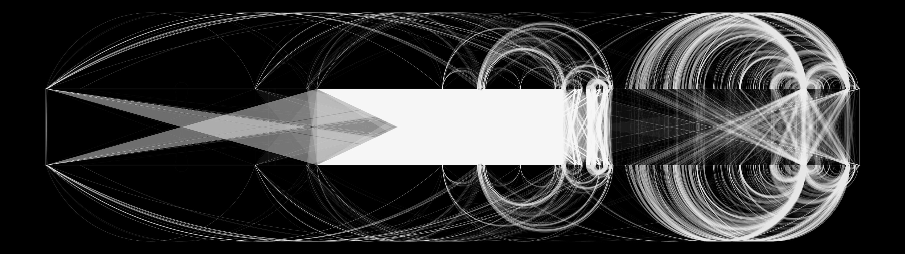


#### calc.exe

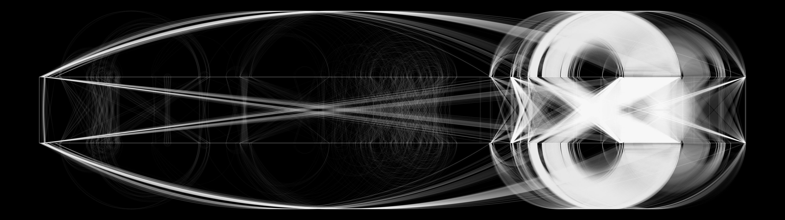


#### explorer.exe

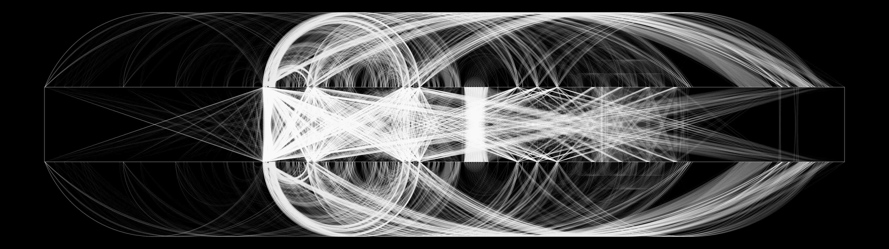


### Fonts

#### Arial TTF
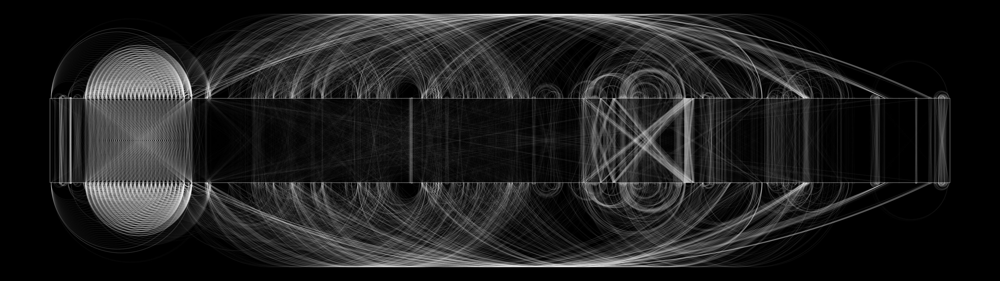

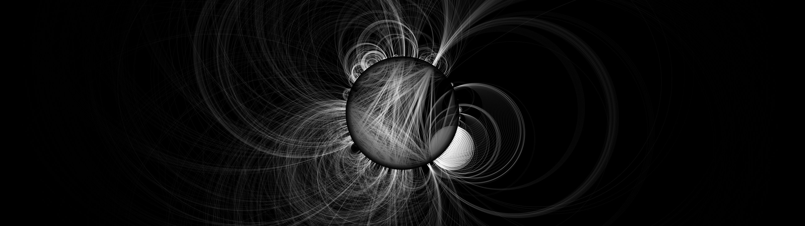

#### Comic Sans TTF
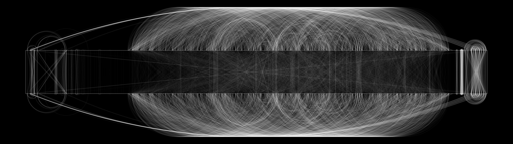

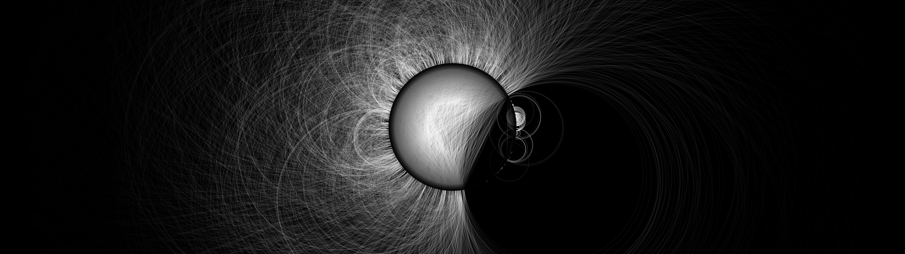

#### Courier New TTF
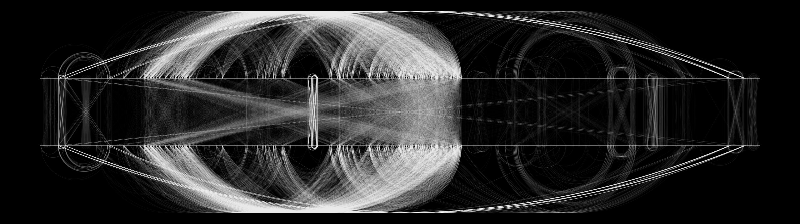

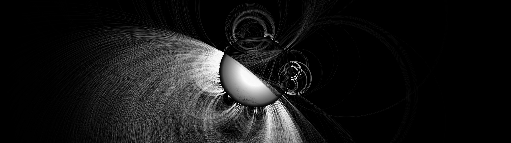

### Libraries

#### kernel32.dll

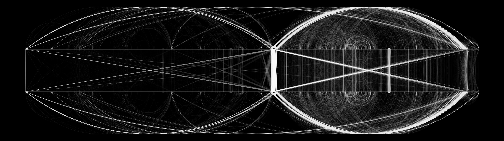


#### spwizres.dll

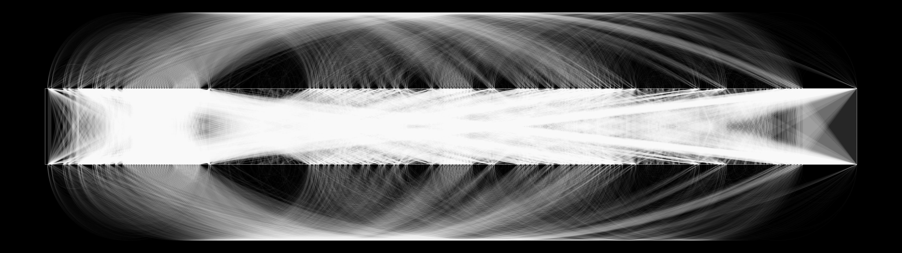

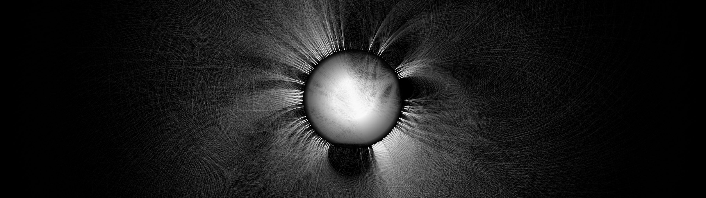

#### user32.dll

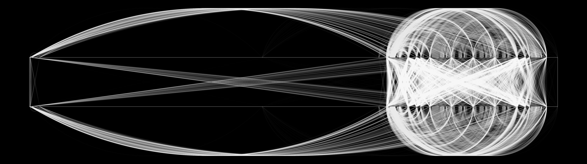

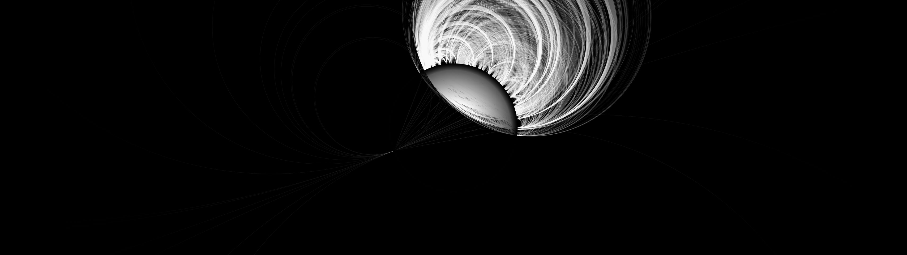

### Images

#### Windows 95 Default Background ("Clouds")

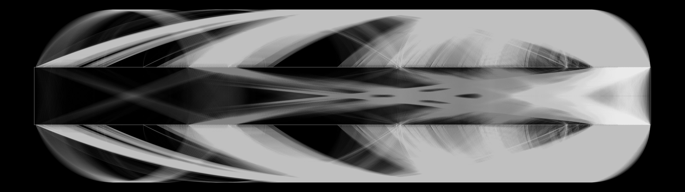


#### Windows XP Default Background ("Bliss")

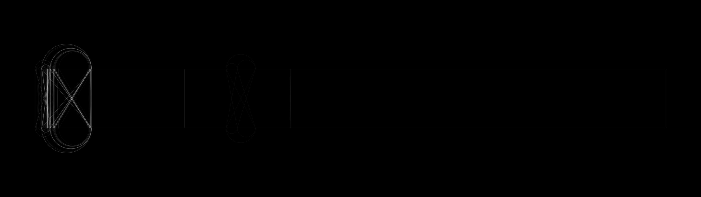


### Plain Text

#### Windows XP EULA

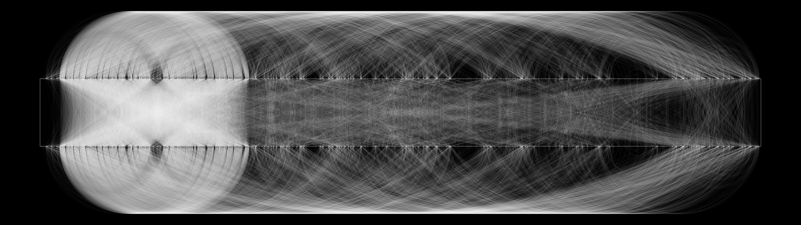

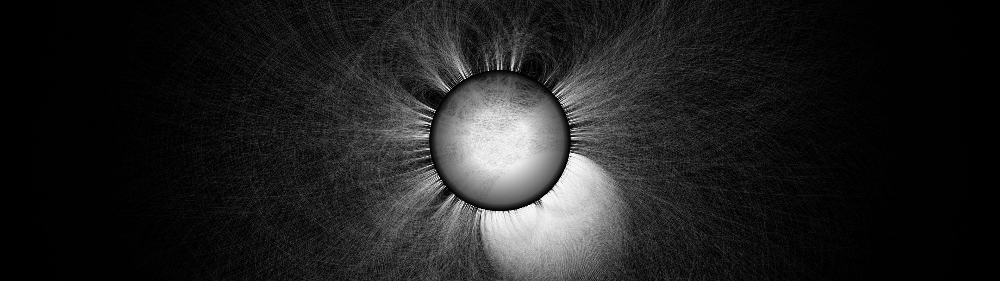

#### Pascal's Pensées

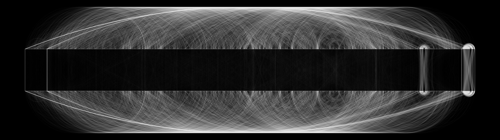

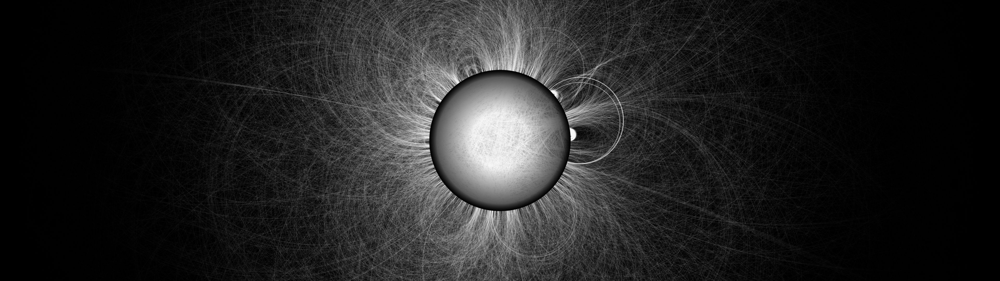

### Audio

#### Windows XP startup sound

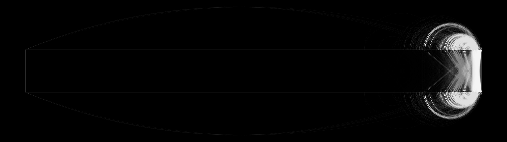


#### Windows XP WMA (Beethoven's 9th, included with install)

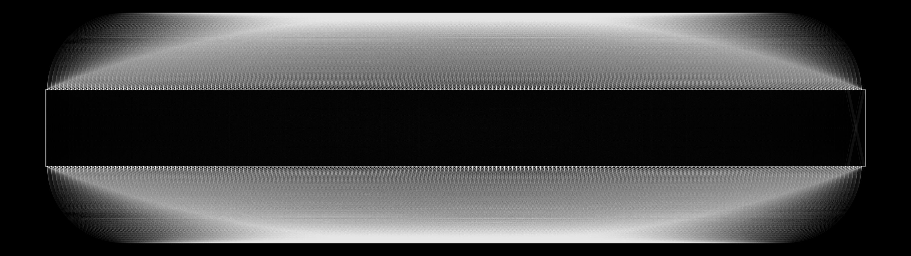

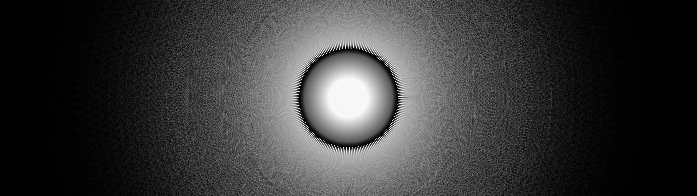

## Dependencies

```
pip install pycairo numpy pillow
```

`pycairo` builds against the native cairo library, which has to be present
first — `brew install cairo pkg-config` on macOS, or `apt install
libcairo2-dev pkg-config` on Debian/Ubuntu.

## Applications and Future

The tool was developed as a reverse engineering aid: given a single known
example of some data — a struct, a compressed blob, a protocol payload — find
other instances of it in the file without needing additional RE.  The hope was
that regions sharing many repeated subsequences with the known example would
cluster into candidates worth investigating further.

Ultimately, the idea seemed shaky and the use-case narrow, so the technique was
never developed into the sort of seamless plugin it needed to be for useful
research.  The work is shared here so that it is not lost to the ether, in the
hopes that perhaps someone else can build on it.

## AI Disclaimer

This project was originally written by hand in C#.  It has been ported to Python
using LLMs, with little oversight or review.

## Author

`hexcymatix` is a research effort from Christopher Domas (@xoreaxeaxeax).

